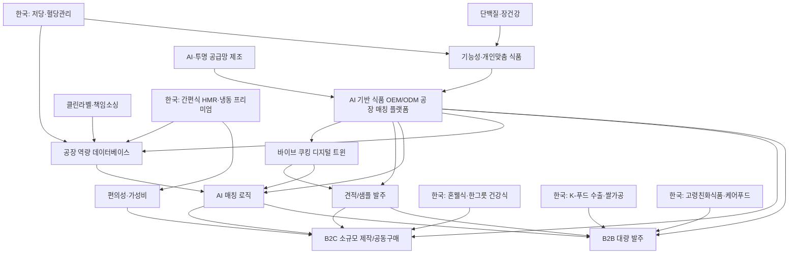

---
aliases:
  - 식품 OEM ODM 아이디어 허브
tags:
  - idea
  - foodtech
  - oem_odm
  - 2026_trend
---

# 식품 OEM/ODM 공장 매칭 플랫폼

## 핵심 요약

[[10_Core_Idea|AI 기반 식품 OEM/ODM 공장 매칭 플랫폼]]은 만들고 싶은 식품을 입력하면 제품 유형, 원료, 공정, 인증, MOQ, 위치, 납기 조건을 분석해 생산 가능한 공장을 추천하는 B2B/B2C 제조 발주 플랫폼이다. [[platform/Vibe_Cooking_Digital_Twin|바이브 쿠킹]]은 이 입력을 레시피, 원재료 BOM, 공정 조건, 표시·인증 체크리스트로 바꿔 실제 재료 발주와 샘플 개발까지 이어지게 하는 디지털 트윈 쿠킹 모듈이다.

- B2B: 브랜드, 창업팀, 유통사, 프랜차이즈의 대량/반복 발주
- B2C: 소규모 제작, 테스트 생산, 공동구매형 생산
- 핵심 차별점: 바이브 쿠킹 기반 제품 개발 사양화, 공장 특성 데이터 표준화, AI 기반 조건 매칭, 견적/샘플 발주 자동화

## 트렌드 체계

- [[20_Trend_Map|글로벌 트렌드 맵]]: 기능성, 개인화, AI, 클린라벨, 책임소싱, 편의성 같은 글로벌 방향성
- [[korea_trends/00_Korea_Trend_Map|한국 트렌드 맵]]: 1인 가구, 저당·혈당관리, HMR, 푸드테크, K-푸드 수출, 케어푸드 등 국내 실행 카테고리
- [[korea_trends/Korea_Global_Comparison|한국 vs 글로벌 트렌드 비교분석]]: 글로벌 전략 언어와 한국 공장 매칭 조건을 연결

## 전체 그래프

## 바로 열기

- [[30_QA_Command_Center]]
- [[app/First_App_Plan]]
- [[app/App_Build_Risk_Review]]
- [[10_Core_Idea]]
- [[20_Trend_Map]]
- [[korea_trends/00_Korea_Trend_Map]]
- [[korea_trends/Korea_Global_Comparison]]
- [[korea_trends/Korea_Source_Factcheck]]
- [[korea_trends/02_Low_Sugar_Blood_Glucose]]
- [[korea_trends/03_HMR_Frozen_Premium]]
- [[korea_trends/05_AI_Personalized_Nutrition_Foodtech]]
- [[trends/Functional_Personalized_Food]]
- [[trends/AI_Transparent_Supply_Chain]]
- [[trends/Protein_Gut_Health]]
- [[trends/Clean_Label_Responsible_Sourcing]]
- [[trends/Food_ESG_Transparency]]
- [[trends/Convenience_Value]]
- [[platform/B2B_Flow]]
- [[platform/B2C_Flow]]
- [[platform/Vibe_Cooking_Digital_Twin]]
- [[platform/Regulatory_Screening_System]]
- [[mvp/MVP_Start_Casing]]
- [[database/Korea_OEM_ODM_Initial_DB]]
- [[platform/Factory_Data_Model]]
- [[platform/Matching_Logic]]
- [[worksheet_blocks/Excel_Row_Candidates]]
- [[market/Category_Market_Research]]

## 참고 출처

### 글로벌

- https://www.innovamarketinsights.com/trends/top-food-and-beverage-trends-2026/
- https://khni.kerry.com/key-health-and-nutrition-trends/
- https://klinegroup.com/food-nutrition/top-food-nutrition-trends-2026-kline/

### 한국

- https://www.krei.re.kr/foodInfo/page/306?cmd=view&pst=505043
- https://kr.listeningmind.com/2026-health-functional-food-market-trends-2/
- https://www.korea.kr/news/policyNewsView.do?newsId=148932450
