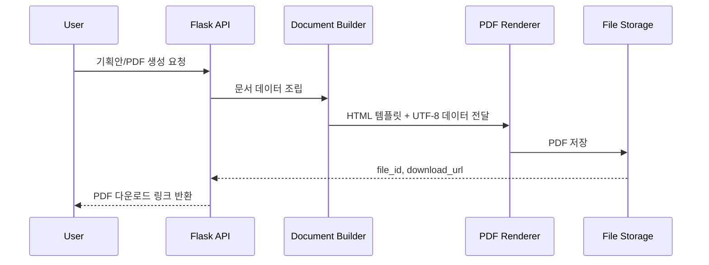
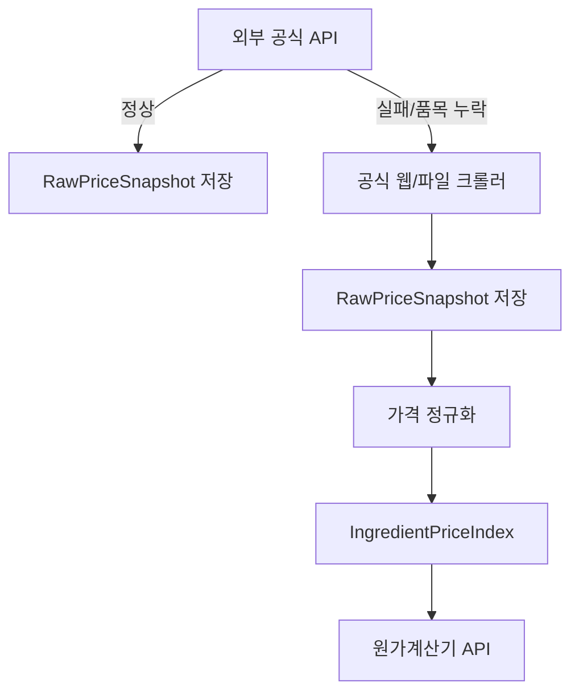

---
aliases:
  - 앱 빌드 리스크 리뷰
  - 기획안 발주안 PDF 원가계산 보강
tags:
  - app
  - risk_review
  - product_plan
  - procurement_brief
  - pdf
  - recipe_evaluation
  - cost_calculator
---

# 앱 빌드 리스크 리뷰 및 문서/PDF/원가계산 보강안

작성 기준일: 2026-07-07

## 결론

[[First_App_Plan|첫 앱 기획안]]은 MVP 범위와 큰 흐름은 잡혀 있지만, 실제 앱을 빌드하려면 아래 6개 영역이 더 구체화되어야 한다.

| 우선순위 | 보강 필요 영역 | 이유 |
|---|---|---|
| 1 | 규제 스크리닝의 책임 범위 | 잘못된 표시·광고 판단은 법적 리스크가 크다 |
| 2 | 레시피 평가와 원가계산 기준 | AI 레시피가 제조 가능성과 수익성을 동시에 만족해야 한다 |
| 3 | 기획안/발주안 PDF 산출 | 사용자가 앱 결과를 실제 업무 문서로 들고 나가야 한다 |
| 4 | 공장별 발주 질문 표준화 | 공장이 답할 수 없는 요청서는 매칭 품질을 떨어뜨린다 |
| 5 | 외부 API/공공 데이터 의존성 | 인증키, 호출 제한, 데이터 갱신 주기, 장애 대응이 필요하다 |
| 6 | 관리자 검증 플로우 | 공장 DB와 규제 룰은 자동화보다 검증 운영이 핵심이다 |

## 실제 앱 빌드 리스크

### 1. 규제 리스크

| 리스크 | 설명 | 대응 |
|---|---|---|
| 기능성 표현 오판 | `혈당`, `면역`, `다이어트`, `치료`, `예방` 같은 표현은 일반식품에서 위험하다 | RED/YELLOW/GREEN은 판정이 아니라 확인 플래그로 표기 |
| 영양표시 기준 변경 | 2026년부터 영양표시 대상과 무당·무가당 정보 제공 기준이 바뀐다 | RegulatoryRule에 effective_date와 source_url 저장 |
| 원료 적합성 오판 | 식품 원료 가능/제한 가능 여부는 현행 기준 확인이 필요하다 | 식품안전나라 원료 목록을 출처 링크로 연결 |
| 공장 인증 과신 | HACCP/GMP 보유 여부만으로 해당 제품 제조 가능성이 보장되지 않는다 | 인증서, 품목 범위, 행정처분 이력 확인 질문 자동 삽입 |
| PDF 문서의 법적 오해 | AI가 만든 발주안이 최종 인허가 문서처럼 보일 수 있다 | PDF 하단에 `검토용 초안`과 책임 제한 문구 삽입 |

### 2. AI/툴콜링 리스크

| 리스크 | 설명 | 대응 |
|---|---|---|
| LLM 환각 | 실제 존재하지 않는 공정, 원료, 인증을 제안할 수 있다 | 공장 매칭은 DB 필터 결과만 사용하고 LLM은 사유 문장 생성에 제한 |
| 툴 실행 순서 꼬임 | 규제 체크 전에 발주안이 만들어지면 위험 질문이 빠진다 | full run 순서를 `사양화 -> 레시피 -> 규제 -> 매칭 -> 문서`로 고정 |
| 재실행 버전 충돌 | 사용자가 입력을 수정한 뒤 이전 결과가 섞일 수 있다 | input_hash와 version으로 툴 결과를 분리 |
| 실패 복구 미흡 | 한 단계 실패가 전체 요청을 막을 수 있다 | 단계별 partial 상태와 재시도 버튼 설계 |
| 비용 폭증 | 2천명 이상 사용 시 LLM 호출이 급증할 수 있다 | 캐시, 요약 저장, 변경분 재실행, 비동기 큐 필요 |

### 3. 데이터/DB 리스크

| 리스크 | 설명 | 대응 |
|---|---|---|
| 태그 검색 한계 | process_tags 같은 배열 필드가 커지면 검색 품질이 떨어진다 | MVP는 고정 태그 + 인덱스, 확장 시 검색 엔진 검토 |
| 공장 DB 신뢰도 | 공개 정보만으로 MOQ, 샘플비, 인증 범위를 알기 어렵다 | verification_status와 last_checked_at 필수 |
| 원가 데이터 부정확 | 원재료 실거래가, 수율, 포장비, 물류비가 없으면 원가가 틀어진다 | CostAssumption을 추정/공장확인/확정 단계로 분리 |
| 영양성분 추정 한계 | 공공 DB의 유사 식품 데이터와 실제 배합 분석값은 다르다 | 앱 결과는 `추정`, 출시 전 시험성적서 필요 표시 |
| 목록 API 과부하 | 요청 목록에 긴 LLM 결과와 PDF 본문을 같이 싣기 쉽다 | 목록은 요약만, 본문/PDF는 상세에서 조회 |

### 4. 문서/PDF 리스크

| 리스크 | 설명 | 대응 |
|---|---|---|
| 한국어 폰트 깨짐 | PDF 생성 시 한글 폰트/인코딩 문제가 자주 발생한다 | UTF-8 고정, 서버에 한글 폰트 번들, PDF 렌더 테스트 |
| 문서 버전 혼선 | 사용자가 수정한 기획안과 발주안이 어떤 입력 기준인지 모를 수 있다 | PDF마다 request_id, version, generated_at 표시 |
| 발주안과 계약서 혼동 | 발주안이 정식 주문/계약으로 오해될 수 있다 | `견적 및 샘플 가능 여부 확인용` 문구 삽입 |
| 공장별 맞춤 누락 | 같은 발주안이 모든 공장에 보내지면 질문 품질이 낮다 | MatchResult별 발주안 섹션 차등 생성 |

### 5. Flutter 앱 리스크

| 리스크 | 설명 | 대응 |
|---|---|---|
| 모바일/웹 화면 밀도 차이 | 같은 UI를 그대로 쓰면 모바일은 복잡하고 웹은 허전해질 수 있다 | 모바일은 단계형, 웹은 비교 테이블 중심 |
| 긴 문서 편집 UX | 모바일에서 PDF 문서 전체 편집은 불편하다 | 모바일은 섹션 확인/수정, 웹은 본문 편집 |
| 상태 동기화 | 툴 실행 중 화면을 나가도 상태가 유지되어야 한다 | ToolRun 상태 폴링 또는 푸시 알림 |
| 오프라인/저장 실패 | 입력 도중 이탈하면 고가치 리드가 사라진다 | draft 자동 저장 |

## 덜 기획된 부분 체크리스트

| 영역 | 현재 부족한 점 | 추가 기획 필요 |
|---|---|---|
| 권한 | 개인, 회사, 관리자, 공장 담당자 권한이 섞여 있다 | role별 화면/행동 정의 |
| 공장 계정 | 공장이 직접 답변하는지 내부 운영자가 중개하는지 불명확 | 1차 MVP는 내부 운영자 중개로 제한 |
| PDF 저장 | 생성한 PDF를 어디에 저장하고 얼마나 보관할지 필요 | file_id, storage_path, expires_at 설계 |
| 원가계산 | 원재료비 외 포장비, 공임, 물류, 샘플비, 수율 반영이 필요 | CostCalculator 데이터 모델 추가 |
| 레시피 평가 | 맛/식감/제조성/규제/원가 평가 기준 필요 | RecipeEvaluation 점수화 |
| 테스트 데이터 | 더미 생성/삭제 기준이 문서화되지 않았다 | DummyRun과 cleanup 기준 필요 |
| 알림 | 툴 완료, RED 리스크, 공장 회신 알림 필요 | notification_type 정의 |
| 감사 로그 | 누가 어떤 PDF를 생성/다운로드했는지 필요 | DocumentAuditLog 추가 |

## 조사한 양식 기준

발주서와 상품기획서 양식은 공개 양식과 실무 설명을 참고하되, 그대로 복제하지 않고 식품 OEM/ODM에 맞게 재구성한다.

| 참고 유형 | 확인한 일반 항목 | 앱에 반영할 항목 |
|---|---|---|
| 발주서 양식 | 발주번호, 발주일, 품명, 규격, 수량, 단가, 금액, 납기, 납품장소, 구매자/공급자 정보 | 샘플 발주번호, 제품군, 목표 수량, 포장, MOQ, 샘플비, 납기, 공장 질문 |
| PDF 발주서 서비스 | 수량·단가 입력 후 공급가액/세액 계산, PDF 다운로드 | 발주안 PDF 생성, 총액/VAT 자동 계산 |
| 상품기획서 양식 | 상품 개요, 시장 분석, 제품 명세, 마케팅 전략, 일정/예산 | 제품 콘셉트, 타깃, 채널, 레시피 방향, 원가/MOQ, 규제 리스크 |
| 제품기획 프로세스 | 타깃 고객, 니즈, 시장 진입 장벽, 제품 콘셉트, 차별화 | 제조 가능성, 규제 장벽, 공장 후보, 샘플 검증 계획 |
| 식품 표시 기준 | 원재료, 영양성분, 강조표시, 무당/무가당, 표시 단위 | 라벨/상세페이지 위험 표현과 시험성적서 질문 |

## 제품 기획안 양식

제품 기획안은 사용자와 내부 운영자가 보는 `사업/제품 판단 문서`다. 공장에 보내기 전, 제품 방향이 맞는지 확인하는 용도다.

### 제품 기획안 PDF 구성

| 순서 | 섹션 | 필드 |
|---|---|---|
| 1 | 문서 표지 | 제품명 후보, 제품군, 작성일, 버전, 작성자 |
| 2 | 한 줄 콘셉트 | 제품 정의, 핵심 차별점 |
| 3 | 타깃 고객 | 구매자, 섭취 상황, 판매 채널 |
| 4 | 시장/채널 가정 | D2C, 공동구매, 프랜차이즈, PB, 예상 판매 단위 |
| 5 | 제품 사양 | 제형, 중량, 포장, 보관, 목표 소비기한 |
| 6 | 레시피 방향 | 주원료, 부원료, 감미/향미, 대체 원료 |
| 7 | 규제 리스크 | RED/YELLOW/GREEN, 위험 표현, 필요 증빙 |
| 8 | 원가/MOQ 가정 | 1식당 원가, 총 제조원가, 예상 공급가, 마진 |
| 9 | 공장 후보 요약 | 후보 공장 유형, 추천 이유, 확인 질문 |
| 10 | 다음 액션 | 샘플 요청, 시험성적서, 라벨 검수, 원료 확인 |

### 제품 기획안 자동 생성 데이터

| 데이터 | 출처 |
|---|---|
| 제품 콘셉트 | vibe_cooking_spec |
| 레시피 방향 | recipe_builder |
| 규제 리스크 | regulatory_screening |
| 원가 가정 | cost_calculator |
| 공장 후보 | factory_matcher |
| 다음 액션 | procurement_brief_writer |

## 샘플 발주안 양식

샘플 발주안은 공장에 전달하는 `견적/샘플 가능 여부 확인 문서`다. 정식 발주서나 계약서가 아니라 공장 회신을 받기 위한 사양서로 둔다.

### 샘플 발주안 PDF 구성

| 순서 | 섹션 | 필드 |
|---|---|---|
| 1 | 문서 표지 | 발주안 번호, 요청 제품명, 대상 공장, 작성일, 버전 |
| 2 | 발주자 정보 | 회사명, 담당자, 연락처, 희망 회신일 |
| 3 | 요청 개요 | 제품군, 목표 수량, 샘플 수량, 판매 채널 |
| 4 | 제품 사양 | 제형, 중량, 포장, 보관, 희망 소비기한 |
| 5 | 레시피/BOM 초안 | 원료 역할, 원료명 후보, 대체 가능 여부, 알레르기 |
| 6 | 공정 조건 | 배합, 성형, 가열, 충진, 포장, 금속검출 등 |
| 7 | 규제 확인 질문 | RED/YELLOW 항목, 라벨/시험성적서/인증 질문 |
| 8 | 견적 요청 | MOQ, 샘플비, 본생산 단가, 리드타임, 결제 조건 |
| 9 | 납품 조건 | 납품지, 포장 단위, 운송 조건, 검수 조건 |
| 10 | 공장 답변란 | 가능/불가, 수정 제안, 필요 자료, 예상 일정 |

### 공장별 발주안 분기

| 제품군 | 자동 추가 질문 |
|---|---|
| 건강간식 | 저당/고단백 영양성분 분석 가능 여부, 알레르기 교차오염 관리, 개별포장 라벨 검수 |
| 분말/스틱 | 일반식품/건강기능식품 제조 범위, GMP 필요 여부, 스틱포 충진 최소 수량 |
| 소스 | 살균 조건, 보존료/산도조절제, 나트륨 저감 가능성, 파우치/병 포장재 증빙 |

## PDF 반환 기획

PDF 반환은 서버에서 생성하고 앱은 다운로드/공유 링크만 받는다. Flutter 클라이언트에서 직접 PDF를 만들면 모바일/웹 렌더 차이와 한글 폰트 문제가 커질 수 있다.

### PDF 산출 흐름

### PDF API 초안

| 기능 | 메서드/경로 초안 | 설명 |
|---|---|---|
| 제품 기획안 PDF 생성 | POST `/product-plans/{id}/pdf` | 기획안 PDF 렌더 작업 생성 |
| 발주안 PDF 생성 | POST `/sample-briefs/{id}/pdf` | 발주안 PDF 렌더 작업 생성 |
| PDF 작업 조회 | GET `/pdf-jobs/{id}` | queued/running/succeeded/failed |
| PDF 다운로드 | GET `/files/{file_id}/download` | 권한 확인 후 다운로드 |
| PDF 재생성 | POST `/pdf-jobs/{id}/rerun` | 같은 버전 재렌더 |

### PDF 데이터 모델

| 테이블 | 핵심 필드 |
|---|---|
| DocumentTemplate | id, doc_type, version, template_name, active |
| DocumentRenderJob | id, doc_type, source_id, template_id, status, file_id, error_code |
| GeneratedFile | id, file_type, storage_path, checksum, created_by, expires_at |
| DocumentAuditLog | id, file_id, user_id, action, created_at |

### PDF 렌더링 기준

| 기준 | 내용 |
|---|---|
| 인코딩 | 모든 입력/출력 UTF-8 고정 |
| 폰트 | 서버에 한글 폰트 포함, PDF 렌더 테스트 |
| 용지 | A4 세로 기본, 공장 비교표는 가로 선택 가능 |
| 버전 | 문서 하단에 request_id, doc_version, generated_at 표시 |
| 워터마크 | draft, needs_review 상태는 `검토용 초안` 표시 |
| 보안 | 다운로드 URL 만료, 회사/사용자 권한 확인 |

## 레시피 평가 API

레시피 평가는 `맛을 보장`하는 기능이 아니라 제조 가능성, 규제 위험, 영양 추정, 원가 적합성을 사전에 점검하는 기능이다.

### 레시피 평가 입력

| 입력 | 설명 |
|---|---|
| RecipeDraft | 배치 크기, 단위 중량, 수율, 원료 라인 |
| ProductSpec | 제품군, 제형, 보관, 포장, 판매 채널 |
| IngredientLine | 원료 역할, 함량 범위, 알레르기, 대체 가능 여부 |
| NutritionReference | 식품영양성분 DB 기반 유사 원료/식품 |
| CostAssumption | 원료 단가, 포장비, 공임, 물류비, 수율 |
| ScreeningFinding | 규제 RED/YELLOW/GREEN |

### 레시피 평가 출력

| 출력 | 설명 |
|---|---|
| manufacturability_score | 제조 가능성 점수 |
| nutrition_estimate | 열량, 탄수화물, 단백질, 지방, 당류, 나트륨 추정 |
| claim_feasibility | 저당/고단백 등 강조표시 가능성 검토 필요 여부 |
| allergen_risk | 알레르기 및 교차오염 위험 |
| process_risk | 가열 안정성, 점도, 수분활성, 분말 균일성 등 |
| cost_score | 목표 원가와의 거리 |
| required_tests | 영양성분 분석, 미생물, 수분활성, 관능 테스트 등 |
| revision_suggestions | 원료 대체, 함량 조정, 포장 변경 제안 |

### 레시피 평가 API 초안

| 기능 | 메서드/경로 초안 | 설명 |
|---|---|---|
| 레시피 평가 실행 | POST `/recipes/{id}/evaluations` | 평가 작업 생성 |
| 레시피 평가 조회 | GET `/recipes/{id}/evaluations/{evaluation_id}` | 평가 결과 조회 |
| 유사 영양성분 검색 | GET `/nutrition-references` | 식품영양성분 DB 기반 검색 |
| 레시피 수정안 생성 | POST `/recipes/{id}/revision-suggestions` | 평가 결과 기반 수정안 |

### 영양성분 데이터 연동

식품영양성분 데이터는 공공 API와 내부 매핑 테이블을 함께 사용한다.

| 데이터 | 사용처 | 주의 |
|---|---|---|
| 식품영양성분 DB | 유사 식품/원료의 영양 추정 | 실제 제품 분석값이 아니므로 추정으로 표시 |
| 식품영양성분 DB Open API | 영양성분 후보 검색 | 인증키, 호출 제한, 데이터 업데이트 확인 |
| 내부 IngredientNutritionMap | 원료명 표준화 | `대두단백`, `분리대두단백` 같은 동의어 관리 필요 |

## 원가계산기

원가계산기는 `1식당 액수`, `총액`, `샘플비`, `MOQ별 원가`를 계산한다. 식품 앱에서는 `1식`을 1개, 1포, 1병, 1팩 등 판매 단위로 정의해야 한다.

### 원가계산 입력

| 입력 | 설명 |
|---|---|
| serving_unit | 1식 단위: 1개, 1포, 1병, 1팩 |
| unit_weight | 1식 중량 또는 용량 |
| target_qty | 생산 수량 |
| ingredient_costs | 원료별 단가, 투입량, 로스율 |
| packaging_costs | 내포장, 외포장, 라벨, 박스 |
| manufacturing_fee | 공임 또는 생산 단가 |
| sample_fee | 샘플 개발비 |
| test_fee | 영양성분, 미생물, 수분활성 등 시험비 |
| logistics_fee | 입고/출고/배송비 |
| platform_fee | 플랫폼 수수료 또는 운영비 |
| vat_rate | 부가세율 |
| margin_target | 목표 마진 |

### 계산 항목

| 항목 | 계산 개념 |
|---|---|
| 원재료비 | 투입량 x 단가 x 로스 반영 |
| 포장비 | 내포장 + 외포장 + 라벨 + 박스 |
| 제조비 | 공임 또는 공장 생산 단가 |
| 직접원가 | 원재료비 + 포장비 + 제조비 |
| 부대비 | 시험비 + 샘플비 + 물류비 + 플랫폼비 |
| 총 제조원가 | 직접원가 + 부대비 |
| 1식당 원가 | 총 제조원가 / 생산 수량 |
| 공급가 제안 | 1식당 원가 / (1 - 목표 마진율) |
| VAT 포함 총액 | 공급가액 x (1 + VAT) |

### 원가계산기 API 초안

| 기능 | 메서드/경로 초안 | 설명 |
|---|---|---|
| 원가계산 실행 | POST `/product-requests/{id}/cost-calculations` | 현재 사양 기준 계산 |
| 원가계산 조회 | GET `/cost-calculations/{id}` | 계산 결과 조회 |
| MOQ 시나리오 생성 | POST `/cost-calculations/{id}/moq-scenarios` | 1천/5천/1만 단위 비교 |
| 원료 가격 후보 조회 | GET `/ingredient-prices` | 내부 단가/KAMIS 등 참고 가격 검색 |

### 원가계산 데이터 모델

| 테이블 | 핵심 필드 |
|---|---|
| CostCalculation | id, request_id, version, target_qty, serving_unit, total_cost, unit_cost |
| CostLineItem | id, calculation_id, category, name, qty, unit, unit_price, loss_rate, amount |
| IngredientPrice | id, ingredient_name, price, unit, source, checked_at |
| MooqCostScenario | id, calculation_id, target_qty, total_cost, unit_cost, margin_price |

### 원료 가격 데이터

| 데이터 | 사용 가능성 | 주의 |
|---|---|---|
| 내부 견적 단가 | 가장 현실적 | 공장/원료사 견적을 받아야 정확 |
| KAMIS 농수축산물 가격 API | 농수축산 원물 참고 가격 | 가공 원료, 단백질 분말, 향료, 포장재에는 한계 |
| 축산물 가격 공공 API | 육류 원물 참고 가격 | MVP 건강간식/분말/소스에서는 우선순위 낮음 |
| 수동 입력 | MVP에 가장 빠름 | 입력자 실수 방지 검증 필요 |

## 원재료 가격 및 환율 데이터 연동

원재료 가격과 환율은 원가계산기의 핵심 입력이다. MVP에서는 `공식 API 우선`, `내부 견적 단가 보정`, `공식 API가 없거나 불안정한 경우 크롤링 기반 내부 API화` 순서로 설계한다.

### 데이터 소스 우선순위

| 우선순위 | 데이터 | 1차 소스 | 2차 소스 | 용도 |
|---|---|---|---|---|
| 1 | 원물 농수산물 가격 | KAMIS/aT 가격정보 Open API | KAMIS 화면 크롤링 후 내부 API화 | 곡물, 과일, 채소, 일부 수산 원물 참고 |
| 2 | 축산물 가격 | 축산물품질평가원 Open API | 축산물품질평가원 화면/파일 데이터 수집 | 우유, 계란, 육류 원료 참고 |
| 3 | 환율 | 한국수출입은행 환율 API | 한국은행 ECOS 환율 통계 API | 수입 원료, 달러 기준 견적 환산 |
| 4 | 가공 원료 가격 | 내부 견적 단가 | 공급사 견적서 수동 입력 | 단백질 분말, 대체당, 향료, 기능성 원료 |
| 5 | 포장재 가격 | 내부 견적 단가 | 포장재 공급사 견적 입력 | 스틱필름, 파우치, 병, 라벨, 박스 |

### 공식 API 후보

| API | 제공 데이터 | 앱 적용 | 주의 |
|---|---|---|---|
| 한국농수산식품유통공사 일별 도·소매 가격정보 | 품목, 품종, 등급, 시장, 조사일가격, kg 환산가격 | 원재료 후보 단가 참고 | 공휴일/주말 누락, 품목 매핑 필요 |
| KAMIS 가격정보 Open API | 농수산물 가격정보 | 곡물/과일/채소 원물 가격 | 가공 원료 단가와 직접 일치하지 않음 |
| 축산물품질평가원 축산물경락가격정보 | 소, 돼지, 닭, 계란 등 경락가격 | 축산 원료 기준가 참고 | API 장애/간헐 오류 대비 필요 |
| 한국수출입은행 환율 정보 | 주요 통화 현재 환율 | 수입 원료 KRW 환산 | 2025-06-25 요청 도메인 변경, 기존 도메인 종료 일정 확인 필요 |
| 한국은행 ECOS Open API | 경제통계, 환율 통계 | 환율 백업/시계열 분석 | 통계 코드 매핑 필요 |

### 가격 데이터 정규화

공공 API의 품목명은 실제 레시피 원료명과 다르다. 따라서 원료 가격 조회는 바로 API를 때리는 방식이 아니라 내부 표준 원료명으로 매핑한 뒤 후보 가격을 보여준다.

| 내부 필드 | 설명 | 예시 |
|---|---|---|
| ingredient_id | 내부 원료 ID | ING-ALLO-001 |
| canonical_name | 표준 원료명 | 알룰로스 |
| alias_names | 동의어/표기 변형 | 알룰로오스, allulose |
| source_category | API 분류 | KAMIS, EKAPE, EXIM, MANUAL |
| source_item_code | 외부 품목 코드 | KAMIS 품목코드 |
| source_unit | 외부 단위 | kg, 100g, 1개 |
| normalized_unit | 내부 단위 | kg |
| conversion_factor | 단위 환산 계수 | 100g -> 0.1kg |
| confidence | 매핑 신뢰도 | exact, similar, manual |

### 환율 적용 방식

수입 원료나 외화 견적이 있는 경우 환율은 원가계산 라인 단위로 적용한다.

| 항목 | 설명 |
|---|---|
| currency | KRW, USD, EUR, JPY, CNY 등 |
| fx_rate | 원화 환산 환율 |
| fx_source | EXIM, BOK, manual |
| fx_date | 적용 환율 기준일 |
| fx_buffer_rate | 환율 변동 버퍼율 |
| landed_cost | 원화 환산 원료비 + 관세/운임/통관비 후보 |

환율은 기본적으로 한국수출입은행 현재 환율을 사용하고, 과거 시계열이나 백업이 필요하면 한국은행 ECOS를 보조 소스로 둔다. 외부 API 장애 시에는 마지막 정상 환율을 `stale` 상태로 표시하고 원가계산 결과에 경고를 붙인다.

### API 실패 시 크롤링 기반 내부 API화

공식 API가 없거나 인증키 발급, 호출 제한, 장애, 품목 누락 때문에 안정적으로 쓰기 어렵다면 크롤러를 내부 배치로 돌리고, 앱은 크롤링 결과를 직접 보지 않고 내부 API만 호출한다.

| 단계 | 설명 |
|---|---|
| 1. 공식 API 호출 | 인증키, 호출 제한, 응답 스키마를 기준으로 수집 |
| 2. 실패 감지 | timeout, 4xx, 5xx, schema_error, empty_result 분류 |
| 3. 크롤링 대체 | robots/약관 확인 후 공식 공개 화면 또는 파일만 수집 |
| 4. 원본 저장 | raw_payload, fetched_at, source_url, checksum 저장 |
| 5. 정규화 | 단위, 품목명, 시장, 등급, 통화를 내부 기준으로 변환 |
| 6. 내부 API 제공 | 앱은 `/ingredient-prices`만 호출 |
| 7. 출처 표시 | 사용자에게 출처, 기준일, 추정 여부 표시 |

### 내부 API 초안

| 기능 | 메서드/경로 초안 | 설명 |
|---|---|---|
| 원료 가격 검색 | GET `/ingredient-prices` | 표준 원료명 기준 후보 가격 조회 |
| 원료 가격 상세 | GET `/ingredient-prices/{id}` | 출처, 기준일, 단위, 신뢰도 조회 |
| 가격 동기화 실행 | POST `/admin/price-sync-runs` | 관리자 수동 동기화 |
| 가격 동기화 조회 | GET `/admin/price-sync-runs/{id}` | 수집 성공/실패 로그 |
| 환율 조회 | GET `/fx-rates` | 통화와 기준일 기준 환율 조회 |
| 환율 동기화 실행 | POST `/admin/fx-sync-runs` | 관리자 수동 동기화 |
| 원료-외부품목 매핑 | POST `/admin/ingredient-source-maps` | 내부 원료와 외부 품목 연결 |

### 데이터 모델

| 테이블 | 핵심 필드 |
|---|---|
| IngredientSourceMap | id, ingredient_id, source, source_item_code, source_item_name, confidence |
| RawPriceSnapshot | id, source, source_url, fetched_at, raw_payload_hash, status |
| IngredientPriceIndex | id, ingredient_id, source, price, unit, normalized_price_kg, market, grade, observed_at |
| FxRate | id, currency, base_currency, rate, source, rate_date, stale_flag |
| PriceSyncRun | id, source, status, started_at, finished_at, error_code |
| CrawlerSourcePolicy | id, source, allowed, robots_checked_at, terms_checked_at, notes |

### 스케줄 정책

| 데이터 | 기본 주기 | 실패 시 |
|---|---|---|
| KAMIS 일별 가격 | 영업일 1회 | 전일 가격 stale 표시 |
| 축산물 가격 | 영업일 1회 | 마지막 정상 데이터 유지, 경고 표시 |
| 환율 | 영업일 1회 또는 요청 전 갱신 | 마지막 정상 환율 + stale 경고 |
| 내부 견적 단가 | 견적 갱신 시 수동 | 유효기간 만료 경고 |
| 크롤링 대체 수집 | API 실패 시 또는 야간 배치 | 3회 실패 시 관리자 알림 |

### 앱 표시 기준

| 상태 | 사용자 표시 |
|---|---|
| confirmed_quote | 공급사/공장 견적 단가 |
| public_reference | 공공 API 참고 가격 |
| crawled_reference | 공개 페이지 수집 참고 가격 |
| manual_input | 사용자가 직접 입력한 가격 |
| stale | 기준일이 오래된 가격 |
| estimated | 단위/품목 매핑으로 추정한 가격 |

원가계산 결과에는 `확정 원가`와 `참고 원가`를 분리한다. 공공 API와 크롤링 가격은 실제 OEM 견적 단가가 아니므로 기본 라벨은 `참고 가격`으로 고정한다.

### 리스크와 대응

| 리스크 | 설명 | 대응 |
|---|---|---|
| API 도메인 변경 | 환율 API처럼 요청 도메인이 바뀔 수 있다 | SourceEndpoint 테이블과 관리자 알림 |
| 호출 제한 | 동시 사용자 증가 시 외부 API 직접 호출이 막힐 수 있다 | 배치 수집 후 내부 API만 앱에 노출 |
| 품목 매핑 오류 | 현미와 현미분말, 대두와 대두단백은 가격 구조가 다르다 | confidence와 manual_review_required |
| 단위 오류 | kg, 100g, 포대, 박스 단위 혼선 | normalized_unit과 conversion_factor 필수 |
| 크롤링 약관 리스크 | 무단 수집 제한 가능성 | 공식 공개 자료만, 약관/robots 확인 기록 |
| 가격 시차 | 공공 가격과 실제 공급가가 다르다 | 견적 단가 우선, 공공 가격은 참고 표시 |

## 추가할 상태와 산출물

| 상태 | 의미 |
|---|---|
| plan_ready | 제품 기획안 생성 완료 |
| cost_ready | 원가계산 완료 |
| recipe_evaluated | 레시피 평가 완료 |
| pdf_ready | PDF 생성 완료 |
| pdf_failed | PDF 생성 실패 |
| price_synced | 원재료 가격 동기화 완료 |
| fx_synced | 환율 동기화 완료 |
| price_stale | 가격 기준일 만료 |

| 산출물 | 설명 |
|---|---|
| ProductPlan | 내부 검토용 제품 기획안 |
| ProcurementBrief | 공장 전달용 샘플 발주안 |
| ProductPlanPDF | 제품 기획안 PDF |
| ProcurementBriefPDF | 공장별 발주안 PDF |
| RecipeEvaluation | 제조성/영양/규제/원가 평가 결과 |
| CostCalculation | 1식당 원가, 총액, MOQ 시나리오 |
| IngredientPriceIndex | 원료별 참고 가격 인덱스 |
| FxRate | 원가계산용 환율 |

## 더미 검증 시나리오

구현 단계에서는 서버를 켠 상태로 아래 더미를 넣고 API, PDF, 계산 결과를 확인한 뒤 더미를 삭제한다.

| 시나리오 | 더미 입력 | 확인 |
|---|---|---|
| 건강간식 기획안 | 저당 고단백 그래놀라바, 40g, 1,000개 | 제품 기획안 PDF 생성, RED/YELLOW 표시 |
| 건강간식 원가 | 원료비 450원, 포장비 120원, 제조비 250원 | 1개당 원가, 총액, VAT 계산 |
| 분말 발주안 | 식이섬유 분말, 20g 스틱, 5,000포 | GMP/일반식품 질문 포함 PDF |
| 소스 발주안 | 저당 매운 소스, 200g 파우치, 1톤 | 살균/나트륨/포장재 질문 포함 PDF |
| PDF 재생성 | 같은 발주안 버전 재렌더 | file_id 변경, version 유지, audit log 저장 |
| 원재료 가격 동기화 | 현미, 대두, 계란, 설탕 후보 가격 조회 | source, 기준일, 단위, stale 표시 확인 |
| 환율 동기화 | USD 원료 견적 1kg당 8달러 | 환율 적용 원화 단가, 기준일, stale 경고 확인 |
| API 실패 대체 | KAMIS 또는 환율 API timeout 가정 | 크롤링/마지막 정상 데이터 fallback 상태 확인 |

### CBT 구현 반영

- 서버 프레임워크는 Flask로 전환했다.
- Flutter 앱은 동일한 `/api/...` 경로를 호출하므로 클라이언트 API 계약은 유지한다.
- 공장 DB 화면은 전체 목록을 직접 노출하지 않고 검색어, 제품군, 인증, 포장, 검증상태, 적합도 필터가 있을 때만 조회한다.
- 레시피 평가, 원재료 가격 인덱스, 환율, 가격 동기화 로그, 문서 감사 로그를 CBT 데이터로 추가했다.

## 개발 전 결정해야 할 질문

1. 공장에는 PDF를 직접 발송할 것인가, 사용자가 다운로드해서 보낼 것인가?
2. MVP에서 공장 계정을 만들 것인가, 내부 운영자가 공장 회신을 등록할 것인가?
3. 원가계산의 기본 단위는 `1개`, `1포`, `1병`, `1팩` 중 제품군별로 어떻게 고정할 것인가?
4. 원료 가격은 MVP에서 수동 입력으로 시작할 것인가, KAMIS 같은 참고 가격을 바로 붙일 것인가?
5. 레시피 평가 점수는 사용자에게 숫자로 보여줄 것인가, `좋음/주의/위험`으로 보여줄 것인가?
6. RED 리스크가 있으면 PDF 생성을 막을 것인가, `검토용 초안` 워터마크로 허용할 것인가?
7. PDF 파일 보관 기간과 삭제 정책은 어떻게 둘 것인가?
8. 원재료 가격은 공공 API 참고 가격과 공급사 견적 가격을 어떻게 우선순위 처리할 것인가?
9. 크롤링 대체 수집은 어느 출처까지 허용하고, 약관/robots 확인 책임자는 누구로 둘 것인가?
10. 환율은 현재 환율만 쓸 것인가, 견적일/발주일/결제일 기준 환율을 모두 저장할 것인가?

## 조사 출처

- 식품안전나라 식품원료 목록: https://www.foodsafetykorea.go.kr/portal/safefoodlife/foodMeterial/foodMeterialDB.do?menu_no=2968
- 식품안전나라 업체 검색: https://www.foodsafetykorea.go.kr/portal/specialinfo/searchInfoCompany.do
- 식약처 2026년 영양표시제도 주요 변경사항: https://www.mfds.go.kr/brd/m_1105/view.do?seq=33773
- 식품등의 표시기준: https://www.law.go.kr/LSW/admRulInfoP.do?admRulSeq=2100000000867
- 식품영양성분 데이터베이스: https://various.foodsafetykorea.go.kr/nutrient/
- 식품영양성분 DB Open API: https://www.data.go.kr/data/15127578/openapi.do
- 식품안전나라 식품영양성분 DB API 항목: https://www.foodsafetykorea.go.kr/api/openApiInfo.do?svc_no=I0750
- KAMIS 가격정보 Open API: https://www.kamis.or.kr/customer/reference/openapi_list.do
- 한국농수산식품유통공사 일별 도·소매 가격정보 API: https://www.data.go.kr/data/15156057/openapi.do
- 축산물품질평가원 축산물경락가격정보 API: https://www.data.go.kr/data/15057912/openapi.do
- 한국수출입은행 환율 정보 API: https://www.data.go.kr/data/3068846/openapi.do
- 한국은행 ECOS Open API: https://ecos.bok.or.kr/api/
- 로폼 발주서 양식/PDF 설명: https://lawform.io/magazine/713
- 상품 기획서 구성요소 참고: https://oscsnm.com/product-planning-template/
