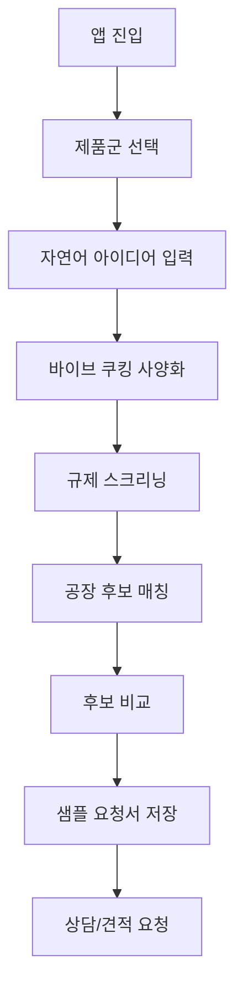
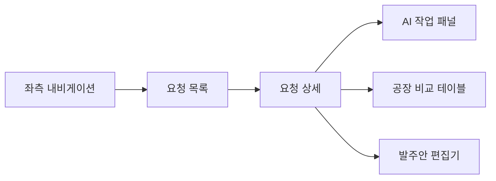
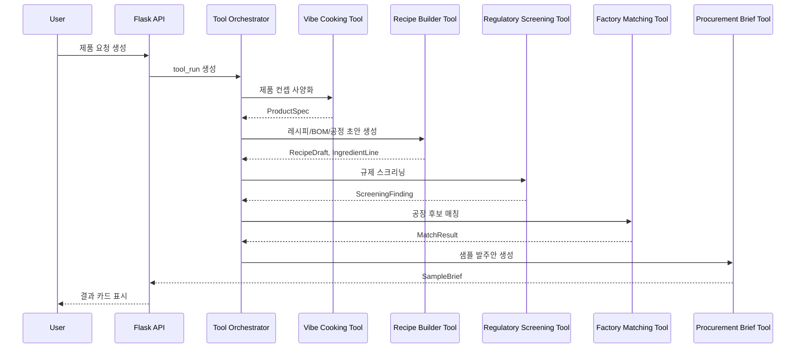

---
aliases:
  - 첫 앱 기획안
  - Food OEM ODM App MVP
tags:
  - app
  - mvp
  - product_plan
  - flask
  - flutter
---

# 첫 앱 기획안: 식품 OEM/ODM 매칭 MVP

작성 기준일: 2026-07-07

## 한 줄 정의

사용자가 만들고 싶은 식품을 입력하면 바이브 쿠킹이 제품 사양을 정리하고, 플랫폼이 적합한 식품 OEM/ODM 공장 후보와 확인 질문을 추천하는 모바일 앱 및 웹 서비스.

## 첫 출시 결론

첫 앱은 전체 식품 제조 플랫폼이 아니라 [[../mvp/MVP_Start_Casing|MVP 시작 케이싱]]의 3개 제품군만 받는다.

| 우선순위 | 제품군 | 앱에서의 표현 |
|---|---|---|
| 1 | 저당·고단백 건강간식 | 건강간식 만들기 |
| 2 | 분말·스틱 건강식품 | 분말/스틱 제품 만들기 |
| 3 | 소스 OEM | 소스 제품 만들기 |

첫 화면은 커뮤니티형 서비스나 마켓이 아니라 `제품 만들기 요청`으로 시작한다. 사용자가 자연어로 아이디어를 입력하고, 앱이 공장 견적 가능한 수준의 사양 초안과 공장 후보를 보여주는 흐름이 핵심이다.

## 목표 사용자

| 사용자 | 주요 목적 | 첫 앱에서 반드시 해결할 것 |
|---|---|---|
| 예비 창업자 | 소량 테스트 생산 | 어떤 제품군으로 바꿔야 생산 가능한지 안내 |
| D2C 브랜드 | 샘플과 초도 생산 | MOQ, 포장, 원가, 인증 조건 정리 |
| 공동구매 운영자 | 수요 기반 한정 생산 | 최소 수량과 판매 채널 기준으로 공장 후보 추천 |
| 프랜차이즈/브랜드 담당자 | 소스·간식 반복 발주 | OEM/ODM 구분, 샘플 요청서, 공장 비교 |

## 핵심 사용자 여정

## MVP 핵심 기능

### 1. 제품 만들기 요청

사용자는 복잡한 양식보다 자연어와 최소 선택지만으로 시작한다.

| 입력 | 예시 | 필수 여부 |
|---|---|---|
| 제품군 | 건강간식, 분말/스틱, 소스 | 필수 |
| 만들고 싶은 제품 | 저당 고단백 그래놀라바 | 필수 |
| 판매 방식 | D2C, 공동구매, 프랜차이즈, PB | 필수 |
| 목표 수량 | 1,000개, 5,000포, 1톤 | 필수 |
| 포장 방식 | 개별포장, 스틱, 파우치, 병 | 선택 |
| 강조 문구 | 저당, 고단백, 식이섬유, 비건 | 선택 |
| 목표 가격 | 소비자가 또는 납품가 | 선택 |

### 2. 바이브 쿠킹 결과 카드

[[../platform/Vibe_Cooking_Digital_Twin|바이브 쿠킹]] 결과는 사용자가 바로 이해할 수 있는 카드로 보여준다.

| 카드 | 내용 |
|---|---|
| 제품 컨셉 | 타깃 고객, 판매 채널, 차별점 |
| 제조 사양 | 공정, 제형, 보관, 포장 |
| 원재료 방향 | 주원료, 감미료, 단백질원, 알레르기 후보 |
| 원가/MOQ 가정 | 테스트 수량, 초도 수량, 예상 단가 범위 |
| 확인 질문 | 공장에 반드시 물어볼 질문 |

### 3. 규제 리스크 표시

[[../platform/Regulatory_Screening_System|규제 스크리닝]]은 확정 판정이 아니라 사전 경고로 제공한다.

| 등급 | 앱 표현 | 행동 |
|---|---|---|
| RED | 출시 전 전문가 확인 필요 | 견적 요청서에 필수 질문으로 포함 |
| YELLOW | 조건에 따라 확인 필요 | 체크리스트로 표시 |
| GREEN | 현재 입력 기준 낮은 위험 | 증빙 보관 항목으로 표시 |

### 4. 공장 후보 매칭

[[../platform/Matching_Logic|AI 매칭 로직]]은 첫 버전에서 복잡한 탐색보다 후보 3~5개 비교에 집중한다.

| 비교 항목 | 설명 |
|---|---|
| 생산 적합도 | 해당 제품군과 공정 가능 여부 |
| MOQ 적합도 | 사용자의 목표 수량과의 거리 |
| 인증/규제 대응 | HACCP, GMP, 라벨 검수, 시험성적서 대응 |
| 샘플 가능성 | 샘플 개발 가능 여부와 예상 리드타임 |
| 매칭 사유 | 왜 이 공장이 추천됐는지 한 문장 설명 |
| 확인 필요 | 실제 상담 전에 확인해야 할 질문 |

### 5. 샘플 요청서

공장 문의 전 왕복 커뮤니케이션을 줄이기 위해 앱이 샘플 요청서 초안을 만든다.

| 섹션 | 내용 |
|---|---|
| 제품 개요 | 제품명, 제품군, 판매 채널, 목표 수량 |
| 제조 조건 | 공정, 제형, 포장, 보관 |
| 원재료/BOM 초안 | 원료 역할 중심의 간단한 표 |
| 규제 확인 | RED/YELLOW 항목과 공장 확인 질문 |
| 견적 요청 | MOQ, 샘플비, 리드타임, 원료 조달 방식 |

## 모바일 앱 화면

Flutter 앱은 반복 사용과 빠른 입력에 맞춘다.

| 화면 | 목적 | 주요 요소 |
|---|---|---|
| 홈 | 새 제품 요청 시작 | 제품군 바로가기, 최근 요청 |
| 제품 입력 | 아이디어 입력 | 자연어 입력, 제품군, 수량, 판매 채널 |
| 사양 결과 | 바이브 쿠킹 결과 확인 | 카드형 요약, 수정 버튼 |
| 리스크 체크 | 규제 플래그 확인 | RED/YELLOW/GREEN 리스트 |
| 공장 후보 | 추천 공장 비교 | 적합도, MOQ, 인증, 확인 질문 |
| 요청서 | 샘플 요청서 확인 | 저장, 공유, 상담 요청 |
| 내 요청 | 진행 상태 관리 | 초안, 검토, 상담중, 보류 |

## 모바일 상세 UX

모바일은 사용자가 식품 제조 지식이 없어도 요청을 끝낼 수 있게 `단계형 입력`과 `수정 가능한 결과 카드`를 중심으로 설계한다.

| 단계 | 화면 구성 | 저장 데이터 | 실패 방지 |
|---|---|---|---|
| 1. 제품군 선택 | 건강간식, 분말/스틱, 소스 3개 선택지 | product_case | MVP 외 카테고리는 대기 리스트로 저장 |
| 2. 아이디어 입력 | 한 줄 입력, 예시 칩, 음성 입력 후보 | raw_prompt | 빈 입력, 과도한 효능 표현 사전 경고 |
| 3. 판매 조건 | 수량, 판매 채널, 포장 방식 | sales_type, target_qty, package_type | 수량 단위 자동 정규화 |
| 4. 희망 콘셉트 | 저당, 고단백, 비건, 매운맛 등 태그 | claim_list, taste_tags | 규제 위험 태그는 경고 표시 |
| 5. 결과 확인 | 사양 카드, 리스크 카드, 후보 공장 카드 | spec_id, screening_id, match_run_id | 재생성 전 변경점 확인 |
| 6. 요청서 저장 | 샘플 요청서 미리보기 | sample_brief_id | 필수 질문 누락 시 저장 전 표시 |

모바일 화면 하단에는 항상 `저장`, `다음`, `수정` 중 하나의 주요 행동만 둔다. 공장 후보 화면에서는 한 번에 여러 액션을 노출하지 않고 `비교`, `요청서 만들기`, `보류` 순서로 이동한다.

## 웹 화면

웹은 B2B 담당자가 비교와 문서 작업을 쉽게 하도록 만든다.

| 화면 | 목적 | 주요 요소 |
|---|---|---|
| 대시보드 | 요청 현황 관리 | 상태별 요청, 최근 매칭, 보류 사유 |
| 요청 상세 | 제품 사양 검토 | 입력값, 바이브 쿠킹 결과, 규제 플래그 |
| 공장 비교 | 후보 비교 | 표 형태 비교, 필터, 매칭 사유 |
| 요청서 편집 | 공장 전달 문서 정리 | 섹션별 편집, PDF/공유 링크 후보 |
| 관리자 | 초기 DB 운영 | 공장 검증 상태, 카테고리, 인증, 출처 |

## 플랫폼 디자인

첫 플랫폼 디자인은 제조 발주 업무 도구처럼 조용하고 밀도 있게 구성한다. 마케팅 랜딩보다 `요청 생성`, `공장 비교`, `문서 작성`이 첫 화면에서 바로 가능해야 한다.

### 정보 구조

| 영역 | 모바일 | 웹 |
|---|---|---|
| 홈 | 새 제품 요청, 최근 요청 3개, 보류 알림 | 상태별 요청 대시보드, 최근 매칭, 관리자 알림 |
| 제품 개발 | 단계형 입력 | 좌측 입력 패널, 우측 결과 패널 |
| 바이브 쿠킹 | 결과 카드 | 컨셉/BOM/공정/원가 탭 |
| 규제 체크 | 위험도 카드 | RED/YELLOW/GREEN 표와 근거 링크 |
| 공장 매칭 | 후보 카드 3~5개 | 비교 테이블, 필터, 매칭 사유 |
| 발주안 | 미리보기 중심 | 문서 편집기, 버전 이력 |
| 관리자 | 최소 기능만 노출 | 공장 DB, 규칙 DB, 매칭 로그 |

### 디자인 원칙

| 원칙 | 적용 |
|---|---|
| 업무형 밀도 | 넓은 히어로, 장식 카드, 과한 일러스트를 피하고 정보 우선 배치 |
| 신뢰 우선 | 공장명, 출처, 검증 상태, 확인 일자를 항상 함께 표시 |
| 위험 명확화 | RED는 상단 고정 경고, YELLOW는 체크리스트, GREEN은 접힌 증빙 항목 |
| 수정 가능성 | AI 결과는 확정값이 아니라 사용자가 수정 가능한 초안으로 표시 |
| 비교 용이성 | 공장 후보는 카드보다 표 비교를 우선하고 모바일만 카드 사용 |
| 상태 가시성 | draft, spec_ready, screening_ready, matched, brief_ready를 배지로 표시 |

### 컬러와 컴포넌트

| 요소 | 디자인 |
|---|---|
| 기본 배경 | 흰색 또는 매우 옅은 회색 |
| 주요 액션 | 녹색 계열 단일 버튼, 보조 액션은 테두리 버튼 |
| 위험 표시 | RED/YELLOW/GREEN은 규제 카드와 배지만 사용 |
| 공장 검증 상태 | 미확인, 확인중, 검증완료, 보류 배지 |
| 입력 컴포넌트 | 세그먼트, 체크박스, 수량 입력, 태그 칩 |
| 비교 컴포넌트 | 고정 헤더 테이블, 후보 잠금 비교, 필터 패널 |
| 문서 컴포넌트 | 섹션 접기/펼치기, 변경 이력, 코멘트 |

### 주요 웹 레이아웃

웹 요청 상세 화면은 3열 구조를 기본으로 한다.

| 열 | 내용 |
|---|---|
| 좌측 | 요청 목록, 상태 필터, 제품군 필터 |
| 중앙 | 제품 사양, BOM, 공정 조건, 규제 플래그 |
| 우측 | 추천 공장, 발주안 미리보기, 다음 액션 |

## Flask 서버 기획

서버는 Flask 기반 REST API로 시작한다. Flutter 클라이언트가 호출하는 `/api/...` 경로는 유지하고, LLM 처리와 매칭 처리는 ToolRun 단위로 분리해 재실행 가능하게 둔다.

| 영역 | 책임 |
|---|---|
| Auth | 사용자, 회사, 권한 관리 |
| Product Request | 제품 만들기 요청 생성/조회/수정 |
| Vibe Cooking | 입력을 제품 사양, BOM, 공정 조건으로 구조화 |
| Regulatory Screening | 규제 플래그와 확인 질문 생성 |
| Factory Matching | 공장 후보 검색과 랭킹 |
| Sample Brief | 샘플 요청서 생성과 버전 관리 |
| Admin | 공장 DB, 규칙 시드, 검증 상태 관리 |

## 툴콜링 오케스트레이션

툴콜링은 사용자의 자연어 입력을 바로 공장 추천으로 보내지 않고, `분류 → 사양화 → 규제 확인 → 매칭 → 문서화` 순서로 고정한다. 각 단계의 결과는 DB에 저장하고 다음 단계는 저장된 구조화 데이터를 입력으로 받는다.

### 툴 실행 원칙

| 원칙 | 내용 |
|---|---|
| 저장 후 실행 | 사용자 입력 원문, 정규화 입력, 각 툴 결과를 모두 저장한다 |
| 재실행 가능 | 같은 요청에서 툴별 재실행을 허용하되 version을 올린다 |
| 입력 고정 | 규제와 매칭은 LLM 원문이 아니라 구조화된 ProductSpec/BOM을 입력으로 받는다 |
| 실패 격리 | 레시피 생성 실패가 공장 DB 조회를 막지 않도록 단계별 상태를 분리한다 |
| 비용 제어 | 목록 조회에서는 툴 결과 요약만 내려주고 상세에서 본문을 조회한다 |
| 감사 로그 | 어떤 툴이 어떤 입력으로 어떤 결과를 냈는지 ToolRun에 남긴다 |

### 툴 카탈로그

| 툴 | 입력 | 출력 | 저장 위치 | 실패 시 처리 |
|---|---|---|---|---|
| `classify_product_case` | raw_prompt, selected_case | product_case, confidence, rejected_reason | ProductRequest | MVP 외 카테고리 보류 |
| `normalize_request_input` | raw_prompt, qty, channel | normalized_qty, sales_type, package_type, claim_list | ProductRequest | 사용자 수정 요청 |
| `vibe_cooking_spec` | normalized input | concept, process_list, storage_condition, cost_assumption | ProductSpec | 초안 저장 후 재생성 |
| `recipe_builder` | ProductSpec, product_case | recipe_draft, ingredient_lines, process_steps | RecipeDraft, IngredientLine | 레시피 없이 매칭 가능 상태 |
| `regulatory_screening` | ProductSpec, IngredientLine, claim_list | findings, evidence_required, blocked_claims | ScreeningRun, ScreeningFinding | RED 상단 고정 |
| `factory_matcher` | ProductSpec, ScreeningFinding | ranked factories, score, reason | MatchResult | 후보 없음 상태 저장 |
| `procurement_brief_writer` | ProductSpec, RecipeDraft, MatchResult | sample_brief, questions, attachments_needed | SampleBrief | 필수 질문만 생성 |
| `factory_question_generator` | MatchResult, ScreeningFinding | factory_questions | SampleBrief section | 수동 질문 입력 허용 |

### ToolRun 데이터

| 필드 | 설명 |
|---|---|
| tool_run_id | 실행 ID |
| request_id | 제품 요청 ID |
| tool_name | 실행 툴 이름 |
| input_hash | 입력 변경 감지용 해시 |
| status | queued, running, succeeded, failed, skipped |
| version | 같은 툴 재실행 버전 |
| started_at, finished_at | 실행 시간 |
| error_code | 실패 원인 분류 |
| summary | 목록에 보여줄 짧은 결과 |

### API 툴콜링 흐름

| 단계 | API | 내부 실행 |
|---|---|---|
| 요청 저장 | POST `/product-requests` | normalize_request_input |
| 사양 생성 | POST `/product-requests/{id}/tool-runs/vibe-cooking` | vibe_cooking_spec, recipe_builder |
| 규제 체크 | POST `/product-requests/{id}/tool-runs/regulatory-screening` | regulatory_screening |
| 공장 매칭 | POST `/product-requests/{id}/tool-runs/factory-matching` | factory_matcher |
| 발주안 생성 | POST `/product-requests/{id}/tool-runs/procurement-brief` | procurement_brief_writer |
| 전체 실행 | POST `/product-requests/{id}/tool-runs/full` | 순차 실행, 실패 단계에서 정지 |
| 실행 조회 | GET `/product-requests/{id}/tool-runs` | 단계별 상태와 요약 반환 |

### 내부/외부 API 호출 기준

외부 공식 데이터는 실시간 호출보다 `주기적 동기화 + 요청 시 확인 링크 제공`을 기본으로 한다. 사용자 요청마다 공공 사이트를 직접 조회하면 속도와 안정성이 떨어지므로, 내부 DB에 최소 필드만 캐싱하고 공식 출처 URL과 확인일을 함께 저장한다.

| 호출 대상 | 용도 | 호출 방식 | 캐시 기준 |
|---|---|---|---|
| 식품안전나라 식품원료 목록 | 원료 사용 가능/제한 가능 후보 확인 | 관리자 동기화 또는 수동 확인 링크 | 원료명, 식용여부, 기준 고시, 확인일 |
| 식품안전나라 업체 검색 | 공장 영업상태, HACCP/GMP, 행정처분 확인 | 관리자 검증 단계에서 조회 | 업체명, 인허가번호, 인증 여부, 확인일 |
| 식품안전나라 공공데이터 API | 공개 API가 있는 항목의 정형 데이터 수집 | 배치 작업 | source_id, raw_payload_hash |
| 식약처 고시/안내서 | 영양표시, 표시광고, 기능성 표현 기준 확인 | 규칙 등록 시 출처 URL 저장 | rule_id, source_url, effective_date |
| 내부 공장 DB | 매칭 후보 검색 | 사용자 요청마다 조회 | Factory, FactoryCapability |
| 내부 규칙 DB | RED/YELLOW/GREEN 판정 | 사용자 요청마다 조회 | RegulatoryRule |

### 툴콜링 실패/재시도 정책

| 실패 지점 | 사용자 표시 | 서버 처리 |
|---|---|---|
| 입력 정규화 실패 | 입력을 조금 더 구체화해 달라는 안내 | draft 유지 |
| 바이브쿠킹 실패 | 사양 생성 실패, 다시 시도 버튼 | ToolRun failed 저장 |
| 레시피빌더 실패 | 레시피 없이 공장 매칭 가능 안내 | RecipeDraft 없이 다음 단계 허용 |
| 규제 스크리닝 실패 | 규제 확인 전 상태로 표시 | matched 진행 차단 |
| 공장 후보 없음 | 조건 완화 제안 | no_match 상태 저장 |
| 발주안 생성 실패 | 필수 질문만 임시 생성 | SampleBrief partial 저장 |

## 바이브쿠킹 및 레시피빌더

바이브쿠킹은 제품의 방향을 제조 가능한 언어로 바꾸고, 레시피빌더는 그 결과를 BOM, 공정, 샘플 테스트 항목으로 더 세분화한다.

### 바이브쿠킹 산출물

| 산출물 | 필드 | 사용처 |
|---|---|---|
| ProductConcept | target_customer, eating_scene, selling_point | 앱 결과 카드, 발주안 |
| ManufacturingSpec | product_type_guess, process_list, storage_condition | 공장 매칭 |
| CostAssumption | target_price, expected_cogs_range, moq_note | 견적 요청 |
| ClaimPlan | claim_list, risky_claims, safer_expression | 규제 스크리닝 |
| ValidationQuestion | taste, texture, shelf_life, label, process | 발주안 질문 |

### 레시피빌더 산출물

| 산출물 | 필드 | 예시 |
|---|---|---|
| RecipeDraft | version, batch_size, unit_weight, yield_rate | 1kg 배치, 40g 바, 수율 92% |
| IngredientLine | role, name, ratio_range, allergen_flag, substitute_allowed | 단백질원, 분리대두단백, 8~15%, 대두 |
| ProcessStep | step_order, process_name, key_condition, factory_capability_tag | 배합, 성형, 굽기, 개별포장 |
| QualityTarget | texture, sweetness, moisture, shelf_life_assumption | 바삭함, 저당, 수분활성 확인 |
| TestPlan | sample_count, test_items, pass_criteria | 3종 샘플, 당류/단백질 분석 |

### 레시피빌더 제한

- 실제 배합비를 확정하지 않고 `범위`와 `검증 질문`으로 둔다.
- 유통기한, 미생물 기준, 영양성분, 기능성 효능은 확정하지 않는다.
- 알레르기, 원료 적합성, 첨가물 기준은 규제 스크리닝 결과와 함께 표시한다.
- 공장에 전달되는 값은 `검토 요청 초안`으로 표기한다.

### 제품군별 빌더 프리셋

| 제품군 | 기본 공정 | 필수 확인 |
|---|---|---|
| 건강간식 | 배합, 성형, 굽기/건조, 냉각, 개별포장 | 알레르기, 저당/고단백 강조표시, 수분활성 |
| 분말/스틱 | 원료 계량, 혼합, 체질, 스틱 충진, 금속검출 | GMP/HACCP, 기능성 표현, 스틱 단위 표시 |
| 소스 | 배합, 가열/살균, 충진, 냉각, 포장 | 살균 조건, 나트륨, 보존료/산도조절제, 포장재 |

## 규제 스크리닝 상세

규제 스크리닝은 법률 판단이 아니라 `사전 위험 분류`, `출처 연결`, `공장/전문가 질문 생성` 기능이다. 기준 출처는 식약처와 식품안전나라의 공식 자료를 우선 사용하고, 규칙에는 출처 URL과 확인일을 저장한다.

### 공식 출처 기준

| 출처 | 앱에서 쓰는 목적 |
|---|---|
| 식품안전나라 식품원료 목록 | 원료 사용 가능/제한 가능 후보 확인 |
| 식품안전나라 업체 검색 | HACCP/GMP, 영업상태, 행정처분 이력 확인 동선 |
| 식약처 2026년 영양표시제도 주요 변경사항 | 영양표시 대상, 무당/무가당 추가 정보 확인 |
| 식약처 일반식품 기능성 표시제도 질의응답집 | 일반식품 기능성 표현 리스크 확인 |
| 식약처 영양표시 가이드라인 | 영양성분 표시 방식과 산업체 가이드 확인 |

### 스크리닝 룰 구조

| 필드 | 설명 |
|---|---|
| rule_id | 규칙 ID |
| scope | claim, ingredient, process, package, factory |
| trigger_type | keyword, ingredient_match, product_case, factory_cert |
| trigger_value | 저당, 혈당, 대두, 스틱포장 등 |
| severity | RED, YELLOW, GREEN |
| message_template | 사용자에게 보여줄 설명 |
| required_evidence | 시험성적서, 라벨 검수, 인증서 등 |
| source_url | 공식 출처 |
| effective_date | 적용 기준일 |
| last_checked_at | 규칙 확인일 |

### 스크리닝 출력

| 출력 | 설명 | 예시 |
|---|---|---|
| blocked_claims | 바로 쓰면 위험한 표현 | 혈당 개선, 치료, 예방 |
| safer_expression | 대체 표현 후보 | 당류를 낮춘 콘셉트, 단백질 함유 |
| evidence_required | 출시 전 필요한 증빙 | 영양성분 분석, 알레르기 표시 검토 |
| factory_questions | 공장에 물어볼 질문 | 알레르기 교차오염 관리가 가능한가 |
| expert_review_needed | 전문가 검토 여부 | 기능성 표현 RED |

### RED/YELLOW/GREEN 처리

| 등급 | UI | 서버 처리 |
|---|---|---|
| RED | 상단 고정, 발주안에 필수 질문 자동 삽입 | brief_ready 전 expert_review_needed 표시 |
| YELLOW | 체크리스트, 공장 질문 자동 삽입 | MatchResult 점수에 반영 |
| GREEN | 접힌 증빙 목록 | 출처와 확인일 저장 |

## 공장 매칭 툴

공장 매칭은 LLM이 자유롭게 공장을 고르는 방식이 아니라 DB 필터링 후 사유 문장을 생성하는 방식으로 설계한다.

| 단계 | 처리 | 쿼리 기준 |
|---|---|---|
| 1. 후보 축소 | product_case 기준 필터 | FactoryCapability.product_case |
| 2. 공정 필터 | process_tags 매칭 | 배합, 성형, 스틱포, 살균, 충진 |
| 3. 포장 필터 | package_tags 매칭 | 개별포장, 스틱, 파우치, 병 |
| 4. 인증 필터 | cert_tags 매칭 | HACCP, GMP, 비건, 할랄 |
| 5. MOQ 필터 | min_moq와 target_qty 비교 | 수량 범위 |
| 6. 규제 보정 | ScreeningFinding 반영 | 알레르기, 라벨, 시험성적서 |
| 7. 사유 생성 | 상위 후보 설명 | MatchResult.reason |

### 점수 구성

| 항목 | 가중치 | 설명 |
|---|---|---|
| 제품군 적합도 | 30 | MVP 3개 케이스와 직접 일치 |
| 공정 적합도 | 20 | 필요한 설비/공정 태그 보유 |
| MOQ 적합도 | 15 | 목표 수량과 최소 수량의 거리 |
| 인증/규제 대응 | 15 | HACCP/GMP/라벨/시험성적서 |
| 샘플 가능성 | 10 | 샘플 개발 가능 여부 |
| 검증 신뢰도 | 10 | 출처, 확인일, 검증 상태 |

## 제품 기획안 작성

제품 기획안은 내부 의사결정과 사용자 확인용 문서다. 공장에 바로 보내는 문서가 아니라 `무엇을 왜 만들지`, `누구에게 팔지`, `제조 가능성은 어떤지`를 정리한다.

### 기획안 섹션

| 섹션 | 내용 | 자동 생성 근거 |
|---|---|---|
| 1. 제품명 후보 | 콘셉트명 3~5개 | raw_prompt, ProductConcept |
| 2. 타깃 고객 | 구매자, 섭취 상황, 가격 민감도 | ProductConcept |
| 3. 핵심 가치 | 저당, 고단백, 간편성, 맛 차별점 | ClaimPlan, taste_tags |
| 4. 제품 사양 | 제형, 중량, 포장, 보관 | ManufacturingSpec |
| 5. 레시피 방향 | 원료 역할, 맛/식감 방향, 대체 원료 | RecipeDraft |
| 6. 시장/채널 가정 | D2C, 공동구매, 프랜차이즈, PB | sales_type, target_channel |
| 7. 원가/MOQ 가정 | 목표 소비자가, 예상 제조원가, 초도 수량 | CostAssumption |
| 8. 규제 리스크 | 위험 표현, 확인 필요 원료, 증빙 | ScreeningFinding |
| 9. 제조 가능성 | 가능 공정, 후보 공장 유형, 병목 | MatchResult |
| 10. 다음 액션 | 샘플 요청, 원료 확인, 라벨 검토 | ToolRun summaries |

### 기획안과 발주안의 차이

| 문서 | 대상 | 목적 | 문체 |
|---|---|---|---|
| 제품 기획안 | 내부 팀, 사용자, 투자/브랜드 담당자 | 제품 방향과 사업성 판단 | 설명형, 비교형 |
| 샘플 발주안 | OEM/ODM 공장 | 가능 여부, MOQ, 샘플비, 리드타임 확인 | 질문형, 사양형 |

## 발주안 작성

발주안은 공장에 바로 전달 가능한 `샘플 개발 요청서` 초안으로 만든다. 견적 요청, 제품 개발, 규제 확인을 한 문서에 섞되 각 섹션을 분리해 공장이 답하기 쉽게 한다.

### 발주안 섹션

| 섹션 | 내용 | 자동 생성 근거 |
|---|---|---|
| 1. 요청 개요 | 제품명, 제품군, 판매 채널, 목표 수량 | ProductRequest |
| 2. 제품 콘셉트 | 타깃 고객, 맛, 식감, 차별점 | ProductConcept |
| 3. 제조 사양 | 제형, 공정, 보관, 포장 | ManufacturingSpec |
| 4. 레시피/BOM 초안 | 원료 역할, 대체 가능 여부, 알레르기 후보 | RecipeDraft, IngredientLine |
| 5. 품질 목표 | 당류, 단백질, 식감, 수분활성 등 확인 항목 | QualityTarget |
| 6. 규제 확인 | RED/YELLOW 항목, 필요 증빙 | ScreeningFinding |
| 7. 견적 요청 | MOQ, 샘플비, 리드타임, 본생산 단가 | MatchResult |
| 8. 공장 답변란 | 가능/불가, 수정 제안, 필요 자료 | Template |

### 발주안 상태

| 상태 | 의미 |
|---|---|
| draft | 사용자 확인 전 초안 |
| needs_review | RED/YELLOW 확인 필요 |
| ready_to_send | 필수 질문 포함 완료 |
| sent | 공장 전달 완료 |
| replied | 공장 회신 등록 |
| archived | 보류 또는 종료 |

### 발주안 툴콜링 입력/출력

| 입력 | 출력 |
|---|---|
| ProductRequest | 요청 개요 |
| ProductSpec | 제품 콘셉트와 제조 사양 |
| RecipeDraft | 레시피/BOM 초안 |
| ScreeningFinding | 규제 확인 질문 |
| MatchResult | 공장별 견적 질문 |
| FactoryCapability | 공장별 맞춤 질문 |

발주안은 공장별로 조금씩 달라져야 한다. 예를 들어 GMP 후보 공장에는 건강기능식품 가능 여부를 묻고, 소스 공장에는 살균/충진/포장재 증빙을 묻는다.

### 공장별 맞춤 질문 예시

| 제품군 | 질문 |
|---|---|
| 건강간식 | 저당/고단백 강조표시를 위한 영양성분 분석 지원이 가능한가 |
| 건강간식 | 대두, 밀, 견과류 등 알레르기 교차오염 관리 기준이 있는가 |
| 분말/스틱 | 일반식품과 건강기능식품 중 어떤 제조 범위가 가능한가 |
| 분말/스틱 | 스틱포 단위 표시와 원료 배합 균일성 검증이 가능한가 |
| 소스 | 살균 조건, 보존료, 산도조절제 사용 기준 검토가 가능한가 |
| 소스 | 파우치/병 포장재의 식품용 재질 증빙을 제공할 수 있는가 |

## API 초안

코딩 전 논리 단위만 정의한다. 실제 엔드포인트 설계 시에는 응답 페이징, 권한, 상태 전이를 먼저 고정한다.

| 기능 | 메서드/경로 초안 | 설명 |
|---|---|---|
| 제품 요청 생성 | POST `/product-requests` | 사용자 입력 저장 |
| 제품 요청 조회 | GET `/product-requests/{id}` | 요청 상세 조회 |
| 바이브 쿠킹 실행 | POST `/product-requests/{id}/vibe-cooking` | 사양화 작업 시작 |
| 규제 스크리닝 실행 | POST `/product-requests/{id}/screening` | RED/YELLOW/GREEN 생성 |
| 공장 매칭 실행 | POST `/product-requests/{id}/matches` | 후보 공장 랭킹 생성 |
| 매칭 결과 조회 | GET `/product-requests/{id}/matches` | 후보 비교 조회 |
| 요청서 생성 | POST `/product-requests/{id}/sample-briefs` | 샘플 요청서 생성 |
| 공장 검색 | GET `/factories` | 관리자/내부 검색 |
| 툴 실행 생성 | POST `/product-requests/{id}/tool-runs` | 특정 툴 실행 |
| 툴 실행 조회 | GET `/product-requests/{id}/tool-runs` | 실행 상태와 결과 요약 |
| 제품 기획안 생성 | POST `/product-requests/{id}/product-plans` | 내부 검토용 기획안 생성 |
| 제품 기획안 조회 | GET `/product-plans/{id}` | 기획안 상세 조회 |
| 발주안 조회 | GET `/sample-briefs/{id}` | 발주안 상세 |
| 발주안 버전 생성 | POST `/sample-briefs/{id}/versions` | 수정본 저장 |
| 공장별 질문 생성 | POST `/matches/{id}/factory-questions` | 후보 공장 맞춤 질문 생성 |

## 데이터 모델 초안

대량 처리를 고려해 첫 버전은 깊은 조인보다 상태와 핵심 필드 중심으로 조회한다.

| 테이블 | 핵심 필드 |
|---|---|
| User | id, email, name, role, company_id |
| Company | id, name, company_type |
| ProductRequest | id, user_id, product_case, sales_type, target_qty, package_type, status |
| ProductSpec | request_id, concept, process_list, package_condition, storage_condition |
| IngredientLine | request_id, ingredient_role, ingredient_name, allergen_flag, substitute_allowed |
| ScreeningRun | id, request_id, overall_status, checked_at |
| ScreeningFinding | screening_run_id, severity, message, required_evidence |
| Factory | id, name, region, verification_status, source_url |
| FactoryCapability | factory_id, product_case, process_tags, package_tags, cert_tags, min_moq |
| MatchResult | id, request_id, factory_id, score, reason, status |
| SampleBrief | id, request_id, version, status, body |
| ToolRun | id, request_id, tool_name, input_hash, version, status, summary |
| RecipeDraft | id, request_id, version, batch_size, unit_weight, yield_rate |
| ProcessStep | id, recipe_id, step_order, process_name, key_condition |
| ProductPlan | id, request_id, version, status, body |
| ProcurementQuestion | id, sample_brief_id, factory_id, question_type, question_text |

## DB 쿼리 원칙

- 제품 요청 목록은 `ProductRequest` 기준으로 상태, 사용자, 생성일 인덱스를 둔다.
- 공장 매칭은 `FactoryCapability`의 `product_case`, `process_tags`, `package_tags`, `cert_tags`, `min_moq` 중심으로 먼저 후보를 줄인다.
- 2천명 이상 사용을 전제로 요청 목록과 매칭 결과 조회에는 기본 페이지네이션을 적용한다.
- LLM 원문과 긴 요청서 본문은 목록 API에서 제외하고 상세 API에서만 조회한다.
- 매칭 결과는 매번 실시간 계산하지 않고 `MatchResult`에 저장해 재조회 비용을 줄인다.
- 관리자 검색과 사용자 조회 API를 분리해 불필요한 공장 전체 스캔을 막는다.

## Flutter 앱 구조 기획

코드 생성 전 기준만 잡는다.

| 계층 | 역할 |
|---|---|
| Presentation | 화면, 상태 표시, 폼 검증 |
| Application | 제품 요청 생성, 매칭 실행, 요청서 생성 유스케이스 |
| Domain | ProductRequest, FactoryMatch, ScreeningFinding 모델 |
| Data | Flask API 클라이언트, DTO, 로컬 캐시 |

모바일과 웹을 같은 Flutter 코드베이스로 시작하되 화면 밀도는 분리한다. 모바일은 카드와 단계형 입력, 웹은 표와 상세 패널 중심으로 설계한다.

## 상태 정의

| 상태 | 의미 |
|---|---|
| draft | 사용자가 입력 중 |
| spec_ready | 바이브 쿠킹 사양 생성 완료 |
| screening_ready | 규제 스크리닝 완료 |
| matched | 공장 후보 생성 완료 |
| brief_ready | 샘플 요청서 생성 완료 |
| inquiry_sent | 상담/견적 요청 발송 |
| on_hold | RED 리스크 또는 사용자 보류 |

## 운영 관리자 기능

첫 앱은 공장 DB 신뢰도가 핵심이므로 관리자 기능을 MVP에 포함한다.

| 기능 | 이유 |
|---|---|
| 공장 후보 등록 | 공개 DB와 수동 검증 후보 관리 |
| 검증 상태 변경 | 미확인, 확인중, 검증완료, 보류 |
| 인증/설비 태그 관리 | 매칭 품질 개선 |
| 규제 규칙 시드 관리 | RED/YELLOW/GREEN 기준 관리 |
| 매칭 로그 확인 | 추천 사유와 실패 조건 개선 |

관리자 공장 DB는 전체 목록을 바로 노출하지 않는다. 검색어, 제품군, 인증, 포장, 검증상태, 적합도 필터가 들어온 경우에만 후보를 조회해 대량 DB 스캔과 불필요한 정보 노출을 줄인다.

## 첫 검증 시나리오

구현 단계에서 서버를 켠 상태로 더미 데이터를 넣어 정상 동작을 확인하고, 검증 후 더미는 삭제한다.

| 시나리오 | 더미 입력 | 성공 기준 |
|---|---|---|
| 건강간식 | 저당 고단백 그래놀라바, 1,000개, 개별포장 | 곡물스낵 공장 후보 3개 이하로 추천 |
| 분말/스틱 | 식이섬유 분말, 5,000포, 스틱포 | GMP/HACCP 후보와 일반식품/건기식 확인 질문 생성 |
| 소스 | 저당 매운 소스, 1톤, 파우치 | 소스 OEM 후보와 살균/나트륨/알레르기 질문 생성 |

## 출시 범위

### 포함

- 회원/회사 기본 계정
- 제품 만들기 요청
- 바이브 쿠킹 사양 카드
- 규제 스크리닝 플래그
- 공장 후보 3~5개 추천
- 샘플 요청서 초안
- 관리자 공장 DB 관리

### 제외

- 결제
- 전자계약
- 실시간 채팅
- 자동 발주
- 실제 법률/인허가 최종 판정
- 전체 식품 카테고리 대응
- 공장 리뷰 공개 커뮤니티

## 성공 지표

| 지표 | 목표 |
|---|---|
| 제품 요청 완료율 | 입력 시작 대비 요청 저장 60% 이상 |
| 사양 생성 성공률 | 제품 요청 대비 사양 생성 90% 이상 |
| 매칭 가능률 | MVP 3개 제품군 요청 중 후보 1개 이상 80% 이상 |
| 상담 전환율 | 매칭 결과 조회 후 요청서 저장 30% 이상 |
| 공장 피드백 | 요청서만 보고 가능/불가 판단 가능하다는 응답 확보 |

## 개발 순서

1. Flask 데이터 모델과 제품 요청 API 정의
2. 관리자용 공장 DB 입력/조회 기능
3. Flutter 제품 입력 화면
4. 바이브 쿠킹 사양화 작업 연결
5. 규제 스크리닝 플래그 생성
6. 공장 매칭과 결과 저장
7. 샘플 요청서 생성
8. 더미 데이터 기반 엔드투엔드 검증 후 더미 삭제

## 관련 노트

- [[../10_Core_Idea]]
- [[../mvp/MVP_Start_Casing]]
- [[../platform/Vibe_Cooking_Digital_Twin]]
- [[../platform/Regulatory_Screening_System]]
- [[../platform/Matching_Logic]]
- [[../platform/Factory_Data_Model]]
- [[../platform/B2B_Flow]]
- [[../platform/B2C_Flow]]
- [[../database/Korea_OEM_ODM_Initial_DB]]
- [[App_Build_Risk_Review]]
